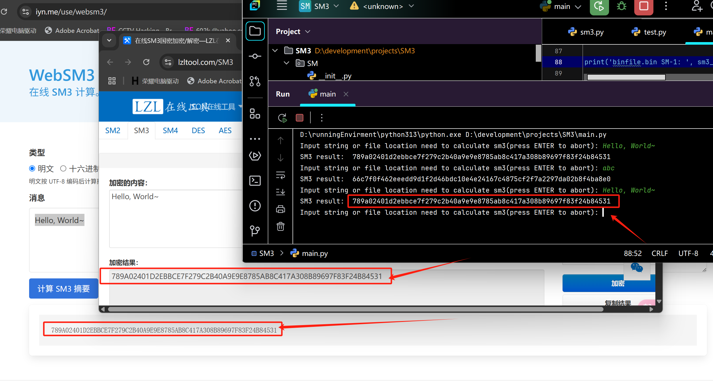

# SM3

SM3 is the Chinese standard hashing algorithm.  
For more details, refer to the [official documentation](./32905-2016-gbt.pdf).

### Author: Kyi Wong  

**Email:** kyiwong97@gmail.com  

## Goal  

Generate the SM3 hash result efficiently.  

## Result  

  

## Contribution Needed  

We need to optimize the `sm3_algorithm` function in `SM.sm3.py`.  
Currently, it performs poorly when processing files larger than a few gigabytes.

## License 

This project is licensed under the [MIT license](./LICENSE).
